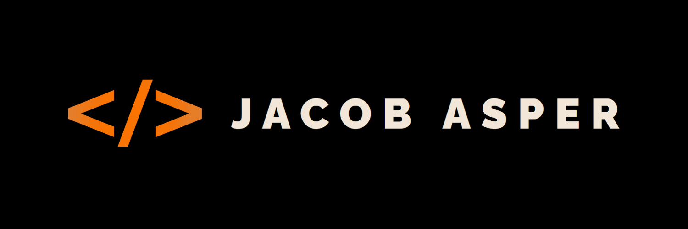

### Hi there 👋

<!--
**20jasper/20jasper** is a ✨ _special_ ✨ repository because its `README.md` (this file) appears on your GitHub profile.

Here are some ideas to get you started:

- 🔭 I’m currently working on ...
- 🌱 I’m currently learning ...
- 👯 I’m looking to collaborate on ...
- 🤔 I’m looking for help with ...
- 💬 Ask me about ...
- 📫 How to reach me: ...
- 😄 Pronouns: ...
- ⚡ Fun fact: ...
-->  
### 
I'm Jacob, a full-time full-stack freelance developer
  
  

  

- 🌱 I’m currently learning JavaScript  
  

- ❓ Ask me about anything related to MERN stack and related technologies  
  

   

## My Skill Set  

### Frontend  

  
  
  
 
  
  

  

   

## Connect with me  

  

  

 

----

Generated using <a href="https://profilinator.rishav.dev/" target="_blank">Github Profilinator</a>

