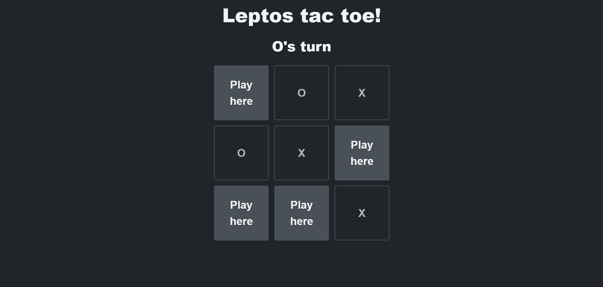
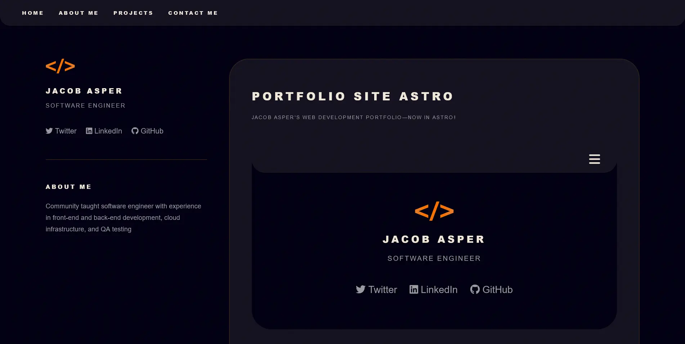
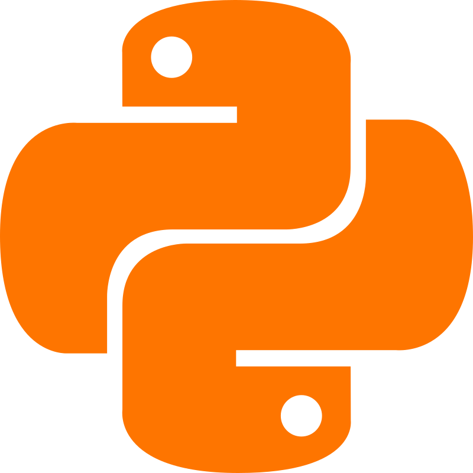
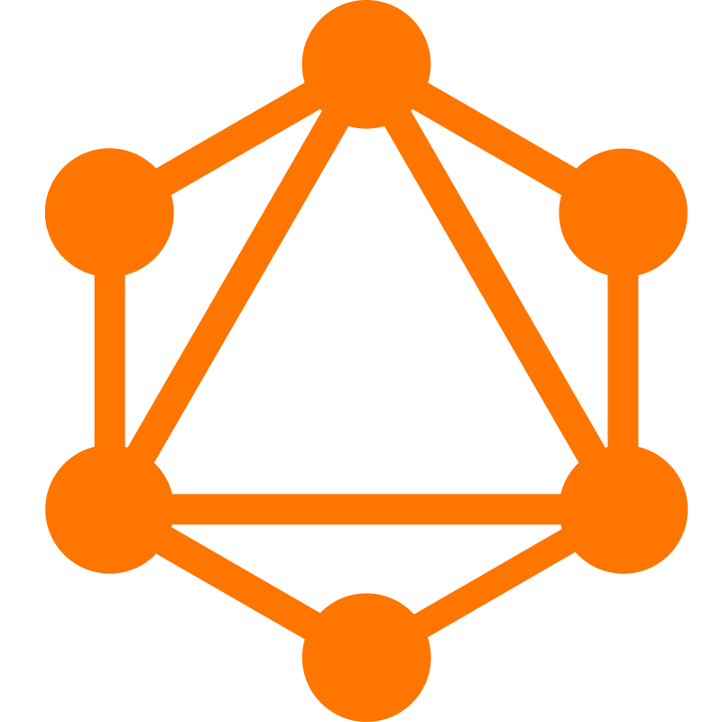

<!DOCTYPE html>

  

<h1 align="center">I'm Jacob, a full stack web developer</h1>

  

  Software engineer with experience in front-end and back-end development, cloud
  infrastructure, and QA testing

  Go to <a href="https://jacobasper.com">my portfolio</a> for more information!

<h2 align="center" color="white">Projects</h2>

  <table>
    <tr>
      <tr><td width="50%">
                  <h3 align="center" color="white">
                    Leptos Tac Toe
                  </h3>
                  

                    
                    

                      
                      
                    

                    
Tic Tac Toe built with Rust and Leptos

                    
Rust and Leptos

                  

                </td><td width="50%">
                  <h3 align="center" color="white">
                    Portfolio Site Astro
                  </h3>
                  

                    
                    

                      
                      
                    

                    
Jacob Asper&#39;s web development portfolio—now in Astro!

                    
TypeScript, Astro, and CSS

                  

                </td></tr><tr><td width="50%">
                  <h3 align="center" color="white">
                    Interview Question API GraphQL
                  </h3>
                  

                    
                    

                      
                      
                    

                    
Query full stack interview questions by category

                    
Rust, GraphQL, and axum

                  

                </td><td width="50%">
                  <h3 align="center" color="white">
                    Five Line Rhyme
                  </h3>
                  

                    
                    

                      
                      
                    

                    
A collection of poems only five lines long

                    
JavaScript, CSS, Node, Express, Pug, MongoDB, and Mongoose

                  

                </td></tr>
    </tr>
  
</table>

  <h2>Skills</h2>
  

    
  

<h2 align="center">Connect with me</h2>

  

